# 星知学园 · AI Learning Studio

**把学习材料变成有出处的回答、可诊断的练习和每天做得完的复习计划。**

[English](#english) · [架构](docs/architecture.md) · [启动](docs/development.md) · [测试](docs/testing.md) · [算法实验](docs/algorithm-experiments.md)

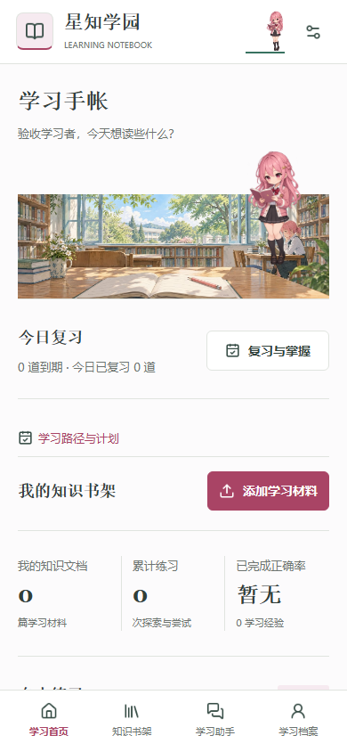

## 学什么，练什么，为什么

上传课程资料、自学笔记或面试知识，选取材料提问，再把知识点编成练习。
答案不是一句“你答错了”：可以回到原文，查看判分依据，选择收进哪一本错题本，
再用学习关系图和到期复习把零散知识串起来。

- **能回到原文的问答**：中文 BM25 + 向量检索 + RRF；引用带文档版本、页码或章节、片段。找不到依据、资料冲突和接口失败分别呈现。
- **自己决定一套题**：总量 1–20 道，单选、多选、填空、判断、问答分别设置数量。服务端判分，作答前不返回标准答案；问答按结构化评分规则复盘。
- **生成失败可以接着来**：跨批次检查重复题，只修复未通过的批次；最多 10 次模型尝试，展示实际次数。失败后明确重新生成，重复点击复用任务。
- **循序提示的学习助手**：苏格拉底辅导、错题诊断、引用核验，生成下一套练习需要明确确认。公开主题可选择联网搜索，私人文档不发送给搜索服务。
- **看得见依据的复习**：BKT 记录掌握估计，FSRS 安排复习，前置关系与可用时间共同约束计划。确认后保存，不偷偷改计划。
- **自己的错题与梳理图**：新建/选择错题本，主动收藏；复盘生成内容梳理、证据网络和关系图，图与原文可以对照。
- **有各自故事的学习伙伴**：樱野小满和秋庭澄各有独立主性格、次性格、背景及四章故事。可拖动、点击、收起；长按有 30% 概率邀请聊天。记忆按账号和角色分开，需确认，可删除或完整重置。
- **安静一点，也鲜活一点**：五套主题、原创手绘场景、可关闭动效。H5 与微信小程序共用 Taro 业务代码，平台交互分别适配。
- **两端一份学习档案**：账号密码与微信登录可选；陌生微信先选择注册、绑定或取消。扫码确认后才登录/换绑，找回密码支持绑定微信或一次性恢复码。微信正式扫码仍需小程序发布，见 [账号与微信](docs/accounts.md)。

| 按类型配题 | 引用与学习辅导 | 复盘关系图 |
| --- | --- | --- |
| 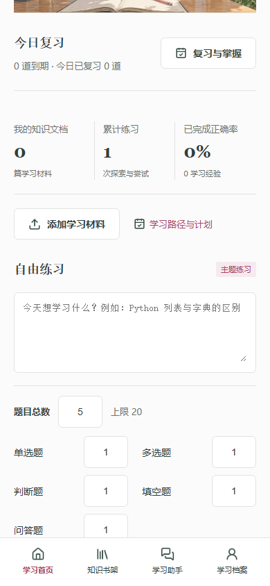 | 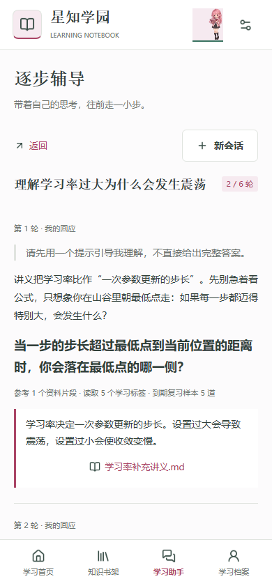 | 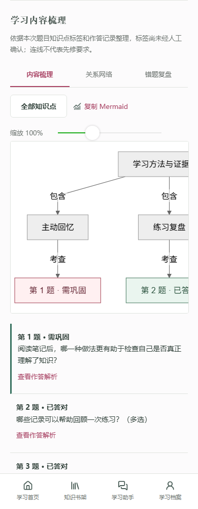 |

| 指定错题本 | 确认学习计划 | 独立伙伴对话 |
| --- | --- | --- |
| 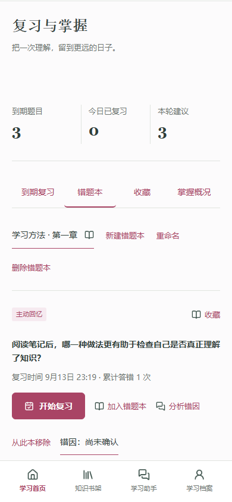 | 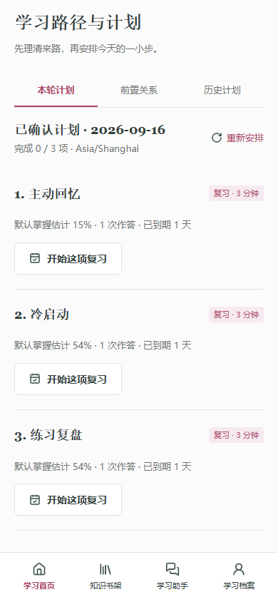 | 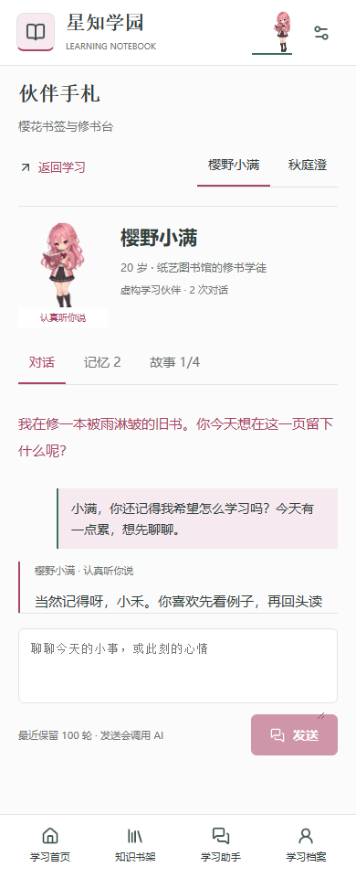 |

以上均来自真实运行的 **H5**，使用隔离测试账号与合成学习材料。不是小程序截图，也不是设计稿。

### 手机与 PC

**推荐使用手机浏览器，移动端体验更佳。** PC 也可完整访问，适合整理材料和查看较大的学习关系图。
下面分别是 390 px 手机视口和 1440 px PC 视口的真实 H5 运行截图，不代表 iOS/Android 真机全部验收。

| 手机端 H5 | PC 端 H5 |
| --- | --- |
| 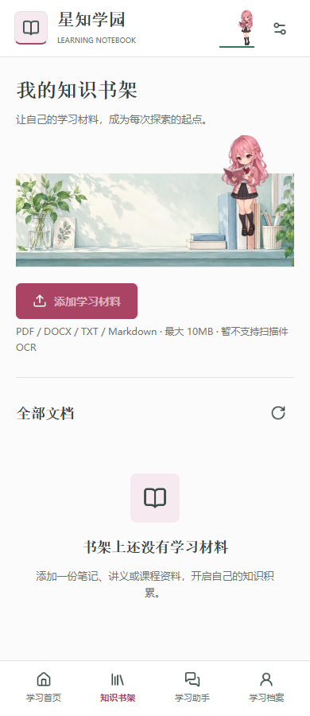 | 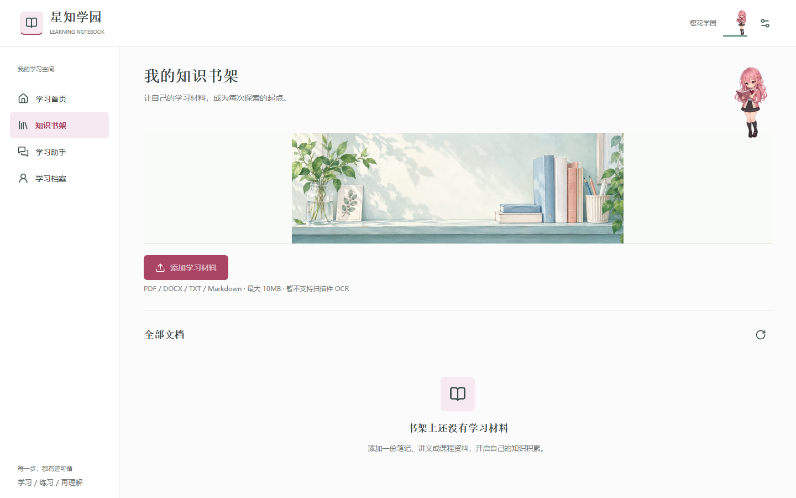 |
|  | 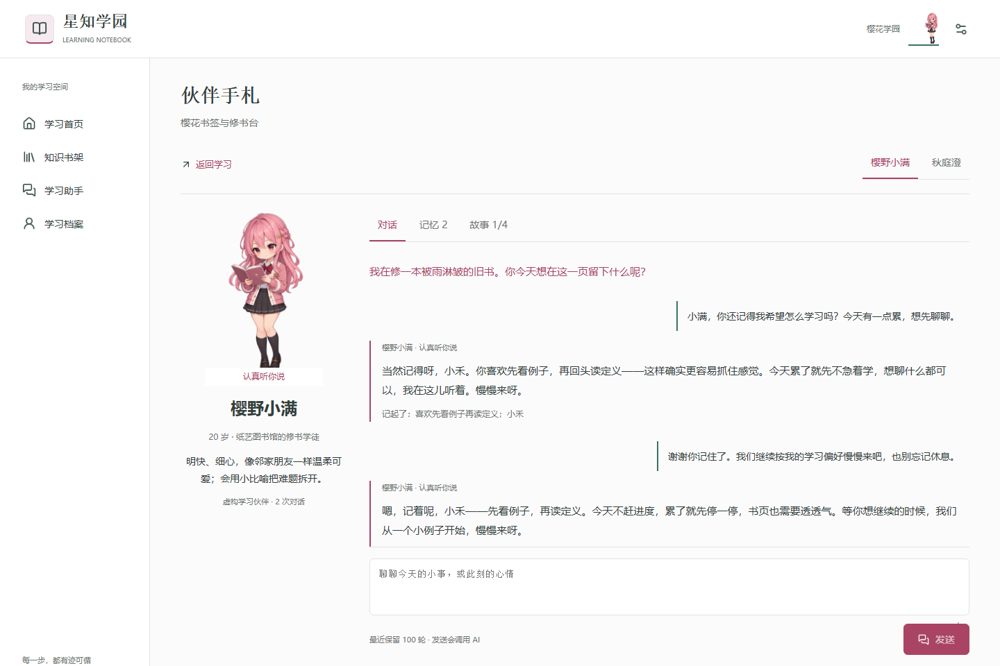 |

### 微信小程序

以下来自微信开发者工具实际运行，AppID 为 `wx7abde39fb8222887`，不是 H5 套壳截图。
当前工具的私人设置关闭了域名校验；截图证明页面运行，不代表合法域名、真机或正式发布已经验收。

| 学习首页 | 知识书架 | 伙伴手札 |
| --- | --- | --- |
| 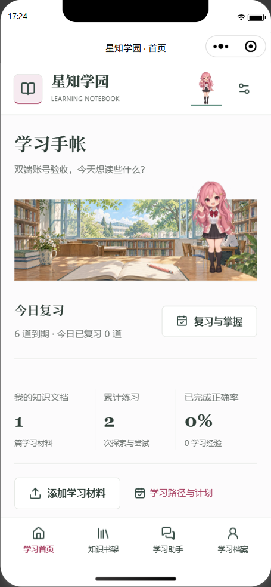 | 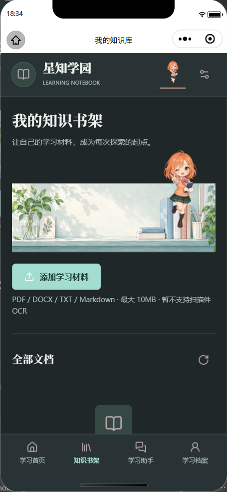 | 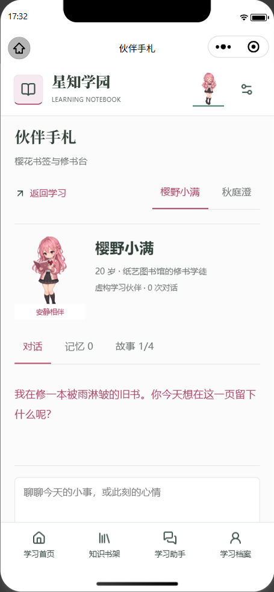 |

| 小程序账号登录 | 小程序账号安全 | 手机 H5 账号安全 |
| --- | --- | --- |
| 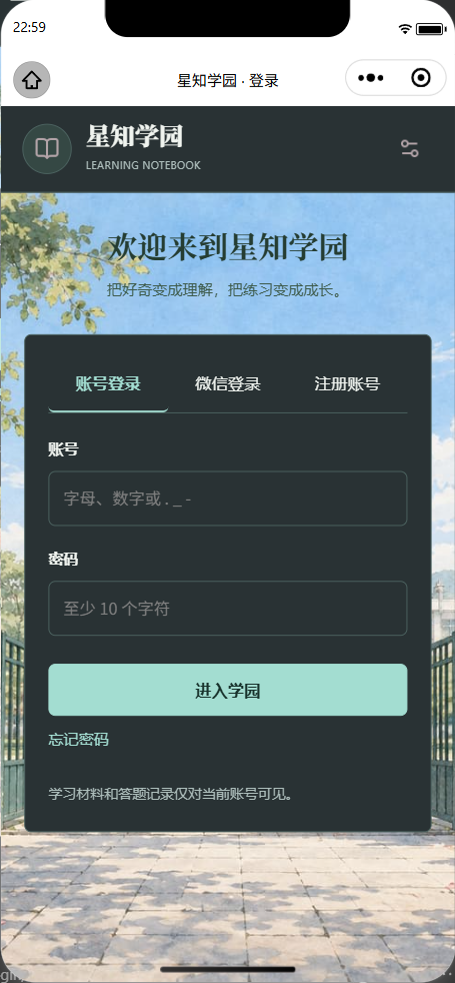 | 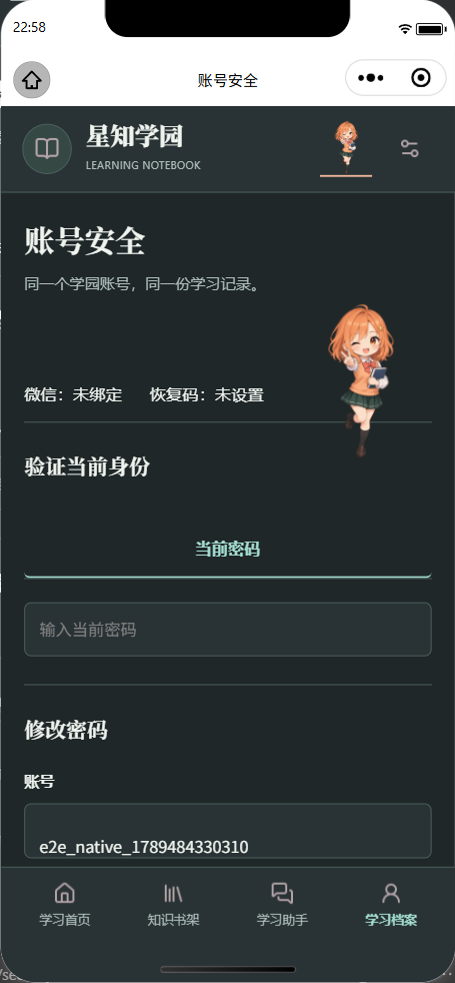 | 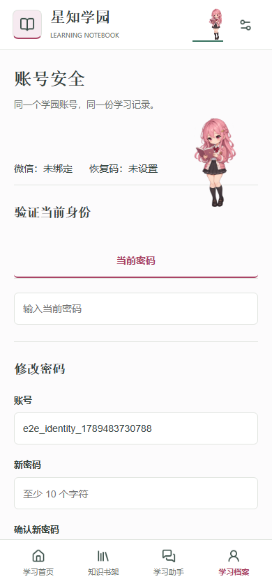 |

账号注册、恢复码找回、旧会话失效均经开发工具实际操作。开发版官方码与真实微信确认已联调；不代表真机摄像头扫码或正式版已通过。

## 访问状态

| 项目 | 当前状态 |
| --- | --- |
| 源码 | [ai-knowledge-learning-miniapp](https://github.com/LuxUmbra697/ai-knowledge-learning-miniapp)，开发分支 `codex/learning-studio-upgrade` |
| 在线 H5 | [打开星知学园](https://lux-umbra.xyz/ai-learn/)；公网注册、上传、真实模型问答、五题型练习与复盘已验证 |
| API 前缀 | `https://lux-umbra.xyz/ai-learn/api/v1`；ready、鉴权和 JSON 404 已验证 |
| 微信小程序 | 官方 WXSS 编译及开发工具页面/角色切换通过；合法域名校验、真机、体验版、审核及正式发布未验收 |

## 为什么这样实现

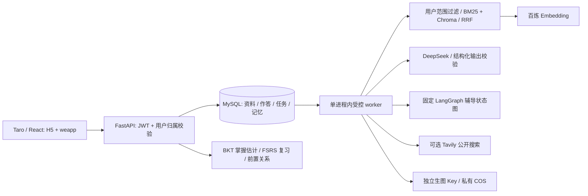

保留原有 Taro 4.1.11、React 18、FastAPI、MySQL、Chroma，不另起前端或迁移数据库。
MySQL 同时承担任务租约、幂等和检查点；一个 API 进程内运行一个 worker，
避免多进程同时写嵌入式 Chroma。普通阶段最多三次尝试；练习生成各批次共享最多十次模型尝试。
超时、取消、预算耗尽和供应商结果不确定都有明确状态；授权或额度错误不会盲目重试。
这不是多 Agent 集群，也不承诺外部 API 恰好计费一次。

LangGraph 仅用于受约束辅导；原有 ReAct 不是所有业务的执行入口。
RAG、学习算法、伙伴记忆各有独立职责，见 [架构](docs/architecture.md)、[辅导](docs/tutoring.md) 和 [学习路径](docs/learning-paths.md)。

## 从克隆到运行

已验证：Python **3.13.9**、Node **22.19.0**、MySQL **8.0.45**、uv **0.12.5**。
安装 MySQL 8 服务端程序并将 mysqld 加入 PATH。以下从仓库根目录执行；
本地工具只使用回环端口 23308 和本项目 .local/mysql/data，不连接配置中的云数据库。

```sh
git clone https://github.com/LuxUmbra697/ai-knowledge-learning-miniapp.git
cd ai-knowledge-learning-miniapp
git switch codex/learning-studio-upgrade
python -m venv .venv
```

PowerShell 激活：`.\.venv\Scripts\Activate.ps1`；Linux/macOS：`source .venv/bin/activate`。

```sh
python -m pip install uv==0.12.5
uv pip sync --require-hashes backend/requirements-dev.txt
python scripts/local_mysql.py start
python scripts/run_local.py --initialize
npm --prefix frontend ci
npm --prefix frontend run build:h5
npm --prefix frontend run build:weapp
node frontend/scripts/check-build.mjs --both
```

终端一启动 API 和内嵌 worker：

```sh
python scripts/run_local.py --serve-h5 --port 18081
```

终端二启动 H5 预览：

```sh
npm --prefix frontend run preview
```

浏览器打开 http://127.0.0.1:18082/ai-learn/，注册账号；该账号也可用于小程序登录。
没有 Key 时可验证账号、页面和已有数据；需要 AI 的操作会明确失败，不伪造生成结果。

启用真实模型：仅在 backend/.env 不存在时，从 backend/.env.example 创建它，填入自己的配置。
停止终端一后替换启动命令；仍保留隔离数据库和 COS 测试前缀：

```sh
python scripts/run_local.py --with-models --with-search --serve-h5 --port 18081
```

微信开发者工具导入 **frontend/**，miniprogramRoot 已指向 dist/weapp/。
本仓库固定 AppID `wx7abde39fb8222887`；使用其微信账号权限、匹配的后端 AppSecret 和合法 HTTPS 域名。
两端均支持账号密码。H5 微信入口通过官方小程序码确认，不冒充 OpenID 或自动合并账号。
微信新用户可选注册、绑定已有账号或取消；个人中心可设置密码、找回方式与扫码换绑。
默认 `WECHAT_QR_ENV=release` 要求页面已正式发布；开发版联调设置 `develop`，不代表对公众开放。
Fork 到另一 AppID 需同步修改配置及构建断言。
小程序开发地址配置见 [双端启动说明](docs/development.md)。

停止 API/预览使用各自终端的 Ctrl+C；隔离 MySQL 使用 `python scripts/local_mysql.py stop`。
它先核验数据目录，遇到别的 MySQL 会拒绝关闭；停止不会删除数据。

### 配置要点

| 配置 | 用途与缺失行为 |
| --- | --- |
| DEEPSEEK_API_KEY | 问答、出题、复盘、辅导、伙伴对话；未配置不调用付费模型 |
| DASHSCOPE_API_KEY | 文档和问题 Embedding；独立于生图 Key |
| DASHSCOPE_IMAGE_API_KEY、COS_* | 可选配图；空生图地址推导默认地址，空 COS 域名使用桶域名 |
| TAVILY_API_KEY、ENABLE_WEB_SEARCH | 明确选择的公开主题检索；私人材料禁止走此路径 |
| WECHAT_APP_ID/SECRET、WECHAT_QR_ENV | 微信 code 交换与官方小程序码；不影响两端账号密码登录 |
| MYSQL_*、JWT_SECRET | 真实环境数据库和强随机签名密钥；启动不自动迁移 |
| REQUIRE_PAID_MODELS、WORKER_* | 生产要求真实文本/Embedding Key，限制每日调用与输入量 |

不要用示例文件覆盖已有 .env。生产必须关闭 debug/自动建库，使用独立持久化目录。
密钥、私人资料、向量数据、微信私人配置和本地交接记录不进入 Git 或构建上下文。

## 验证与实际指标

```sh
python scripts/test_offline.py -q --tb=short
python scripts/test_database.py --tb=short
python scripts/evaluate_rag.py
python scripts/experiment_bkt.py --output .local/bkt-reproduction
npm --prefix frontend test
npm --prefix frontend run typecheck
npm --prefix frontend exec playwright install chromium
npm --prefix frontend run test:e2e
```

浏览器测试需要前述本地 API、worker、隔离 MySQL 和 H5 正在运行。
默认测试不消耗模型额度；真实供应商测试需显式开关，详见 [测试说明](docs/testing.md)。

| 实测项目 | 结果与条件 |
| --- | --- |
| 后端回归 | 锁定环境：445 项离线、83 项隔离 MySQL 通过；26 项前端单元通过 |
| H5 回归 | Chromium：29 项通过、4 项额外付费场景跳过；包含实际 API/数据库、账号恢复与会话撤销、已保存的供应商结果、重试入口、角色切换与迟到响应回归 |
| 双端构建 | 连续构建互不覆盖；H5 入口 gzip 122,379 B，weapp 主包 1,082,586 B；官方编译器通过 9 个 WXSS 文件，非真机性能指标 |
| 生成重试 | 本地真实模型：8 道五题型练习，4 次模型尝试后完成，题干无重复，作答前答案密封；401、额度不足与第 11 次调用拒绝由确定性测试覆盖 |
| 公网实测 | 真实讲义索引、4 个引用片段、5 种题型、服务端判分、三类梳理图与指定错题本；无新增旧站路由回归 |
| RAG | 104 条合成样例；dense MRR 0.950，混合 0.929，词项重排 0.929；三者 Recall@4 均 1.0。**未测出混合优于 dense** |
| 算法实验 | 800 名合成学习者、24,000 条记录，按学习者划分 480/160/160；BKT 测试 Brier 从默认 0.19552 到拟合 0.18329，仅证明合成实验流程 |

[RAG 数据、参数与原始结果](docs/rag-evaluation.md) · [真实执行的拟合与校准实验](docs/algorithm-experiments.md)

## 目录与维护

```text
backend/app/          API、鉴权、任务、检索、学习算法与伙伴设定
backend/tests/        无付费服务的确定性回归
backend/integration/  隔离 MySQL、事务与恢复测试
frontend/src/         Taro 页面、主题、平台组件
frontend/e2e/         浏览器到 API 和数据库的回归
scripts/              启动、评测、安全检查、发布辅助
eval/                 合成数据、划分、参数与原始实验结果
docs/                 公开技术说明与真实 H5 / 微信开发工具截图
.github/workflows/    隔离 CI，不读取真实 .env 或生产数据库
```

部署采用统一 HTTPS 网关的独立子路径，不抢占 80/443、不改其他站点的 /api/。
迁移、备份、回滚与共存要求见 [部署说明](docs/deployment.md)。

**边界**：扫描件 OCR 未接入；引用逐字匹配不等于语义正确；问答判分不是人类评分保证；
没有真实学习者训练、LoRA/蒸馏或高并发成绩。伙伴是虚构角色，不替代有证据的学习助手。
同域不同路径不是完整安全隔离。微信真机、并发容量与完整灾备恢复需分别验收。
后续重点是独立人工评测、更长资料、真实设备和长期学习数据。

保留原项目合法署名与依赖授权；原创装饰、算法和第三方素材说明见 [来源与许可](docs/assets-attribution.md)。

---

## English

### Study With Sources, Diagnosis and a Real Review Plan

**AI Learning Studio** turns private documents into cited answers, configurable practice,
server-assessed feedback and manageable review plans, for course notes, self-study and interview preparation.

Upload PDF/DOCX/TXT/Markdown, ask against selected documents, choose 1–20 questions across single-choice,
multiple-choice, fill-in, true/false and written types, then inspect the assessment and original evidence.
Explicitly collect mistakes into named notebooks. Content, evidence-network and relationship diagrams
connect the review to its sources. Socratic tutoring provides incremental guidance and asks before
creating practice. BKT estimates mastery, FSRS schedules reviews, and prerequisites/time constrain plans.

Five themes share stable navigation. Two original fictional adult companions, Xiaoman and Cheng,
have different primary/secondary traits, biographies, four story chapters and owner/character-scoped
confirmed memories. Drag, tap, collapse, hide or long-press; long press has a 30% chance of offering
dedicated chat. A gesture alone never buys a model call. Memories can be edited, removed or fully reset.

Both targets support account registration, passwords and recovery. Unknown WeChat users explicitly
register, link an existing account or cancel. Official mini-program codes enable H5 login and
binding/rebinding only after native approval; one user ID keeps both targets' learning records together.
Recovery uses a saved one-time code or verified bound WeChat. Release QR requires a published
mini-program page; see [account security](docs/accounts.md).

The H5 screenshots above use isolated accounts and synthetic data, not mockups.
The separately labeled WeChat gallery comes from the actual DevTools runtime; its private
domain-check setting is disabled, so it is not evidence of legal-domain or physical-device acceptance.

**A mobile browser is recommended for the best day-to-day experience.** PC remains fully accessible
for organizing documents and larger study maps. The paired screenshots above show actual H5 at
390 px mobile and 1440 px PC viewports, not a claim of complete iOS/Android real-device testing.

### Availability and Design

Source: [ai-knowledge-learning-miniapp](https://github.com/LuxUmbra697/ai-knowledge-learning-miniapp),
branch `codex/learning-studio-upgrade`.
Live H5: [Open AI Learning Studio](https://lux-umbra.xyz/ai-learn/), API: `/ai-learn/api/v1`.
Public registration, document indexing, paid grounded Q&A, five question types and review passed.
Both builds, official WXSS compilation and native IDE page/character-switch checks pass.
Legal-domain validation, physical devices, experience upload, review and official publication remain unverified.

The diagram above reflects the implementation: Taro 4.1.11/React 18, FastAPI, MySQL, Chroma,
Chinese BM25/RRF, DeepSeek and DashScope. MySQL owns leases, idempotency, checkpoints and learning state.
One worker shares the API process and embedded Chroma. LangGraph is used for bounded tutoring,
not a claim of a multi-agent platform. Optional Tavily accepts public topics only; optional images
use a separate key and private COS. See [architecture](docs/architecture.md),
[assessment](docs/practice-and-assessment.md), [tutoring](docs/tutoring.md) and [paths](docs/learning-paths.md).

### Run Locally

Verified: Python 3.13.9, Node 22.19.0, MySQL 8.0.45, uv 0.12.5. Put the MySQL 8 server binary on PATH.
Clone and create a virtual environment:

```sh
git clone https://github.com/LuxUmbra697/ai-knowledge-learning-miniapp.git
cd ai-knowledge-learning-miniapp
git switch codex/learning-studio-upgrade
python -m venv .venv
```

Activate with `.\.venv\Scripts\Activate.ps1` on PowerShell or
`source .venv/bin/activate` on Linux/macOS, then:

```sh
python -m pip install uv==0.12.5
uv pip sync --require-hashes backend/requirements-dev.txt
python scripts/local_mysql.py start
python scripts/run_local.py --initialize
npm --prefix frontend ci
npm --prefix frontend run build:h5
npm --prefix frontend run build:weapp
node frontend/scripts/check-build.mjs --both
python scripts/run_local.py --serve-h5 --port 18081
```

In a second terminal run `npm --prefix frontend run preview`, open
http://127.0.0.1:18082/ai-learn/ and register an account usable on both targets. The launcher forces this
project's isolated database at loopback port 23308, never the cloud database from dotenv.
Ctrl+C stops foreground processes. `python scripts/local_mysql.py stop` checks ownership and preserves data.

For real AI, create backend/.env from its example **only if absent**, supply your own credentials,
and replace the API command with
`python scripts/run_local.py --with-models --with-search --serve-h5 --port 18081`.
Text and embedding keys are required for this mode. Separate image/COS, public search and WeChat
credentials enable their respective capabilities. Missing credentials produce explicit errors,
not fake responses. Empty image-base/COS-domain options retain their provider defaults.

Import **frontend/** in WeChat DevTools; the config selects dist/weapp/ and fixed AppID
`wx7abde39fb8222887`. Matching account permissions, server-side AppSecret and legal HTTPS domains
are required. Forking to another AppID requires updating configuration and build assertions.
Both targets accept passwords. H5 WeChat uses official mini-program QR confirmation, not a forged
OpenID or automatic account merge. `WECHAT_QR_ENV=release` requires publication; `develop` is restricted
to authorized development accounts. [Development](docs/development.md) covers startup order,
platform configuration, stopping and troubleshooting.

### Verification and Maintenance

The test block in the Chinese section runs offline tests, isolated MySQL integration, cached RAG
evaluation, BKT fitting, frontend unit/type checks and actual-browser tests. Browser tests need the
local stack. Default CI does not read real dotenv, touch production or spend provider credits.
Explicit paid smoke commands are documented in [testing](docs/testing.md).

Fresh locked environment: 445 offline, 83 MySQL and 26 frontend unit tests passed.
H5 regression: 29 passed, four additional paid cases skipped; saved real-provider outputs were reused.
Native account registration, recovery and session revocation passed in DevTools. Official development
QR, real WeChat code exchange, explicit native confirmation and H5 login passed together; optical
navigation was automated, so camera scanning on physical devices remains unverified.
Quiz batches share at most ten model attempts. Duplicate questions are repaired inside the affected
batch; failed tasks expose explicit, owner-scoped idempotent regeneration. A real local eight-question,
five-type run completed after four model attempts, including timeout and validation recovery.
Both builds pass; entry gzip 122,379 bytes, weapp main 1,082,586 bytes, nine official WXSS
compilations passed. These are build measurements, not device/concurrency benchmarks.

The 104-case synthetic RAG benchmark reports MRR 0.950 dense vs. 0.929 hybrid/lexical-reranked,
all Recall@4 1.0. **No hybrid improvement is claimed.** The BKT experiment splits 800 synthetic
learners 480/160/160 and changes test Brier from default 0.19552 to fitted 0.18329.
It validates an experiment on synthetic data, not real learning effectiveness.
[Retrieval results](docs/rag-evaluation.md) and [algorithm results](docs/algorithm-experiments.md)
include data, parameters, commands and raw evidence.

The directory map above separates application code, offline/database/browser tests, scripts,
evaluation and public documentation. [Deployment](docs/deployment.md) explains shared HTTPS,
explicit migrations, persistence, backups and rollback. Secrets, certificates, private uploads,
vectors and personal handoff notes are excluded from Git and build contexts. Production must disable
debug/auto-initialization and use a strong JWT secret. Same-origin paths are not full isolation.

OCR, semantic entailment guarantees, real-user parameter training, fine-tuning/distillation and
high-concurrency claims are deliberately absent. Written grading is model-assisted, not human
ground truth. Native devices and production recovery require separate evidence. Priorities are
independently labeled evaluation, longer documents, real devices and longitudinal data.
Existing lawful attribution is preserved; see [algorithms and original artwork](docs/assets-attribution.md).
