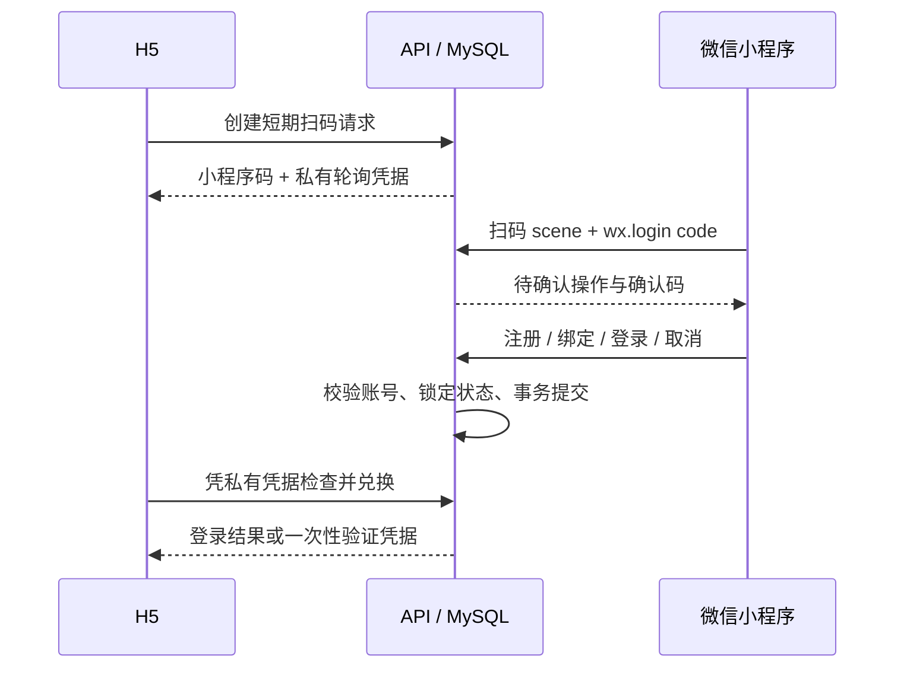

# 账号与微信身份

## 使用方式

首页与隐私说明可直接浏览，不请求私人资料、不自动调用微信登录。点击学习功能时，访客可以去登录或继续浏览；登录后回到刚才的功能。返回路径限制为本站已知页面和限定参数。

H5 和小程序共用账号密码注册、登录、找回密码及账号安全页面。
小程序微信登录由后端交换真实 `wx.login` code。未登记的微信必须选择注册、验证并绑定已有账号或取消；取消不建号。
注册微信账号时可以同时设置账号名和密码，也可以稍后在个人中心设置。
账号安全中可以生成并保存恢复码；不会把未展示的恢复码标记为已设置。

**当前 H5 仅展示账号登录、注册和恢复码找回，不展示微信扫码。** 小程序额外提供微信直接登录、绑定微信找回、在账号安全中验证当前密码后绑定/换绑当前微信。
小程序 `wx.login` 不依赖小程序已正式发布即可供有权限的开发成员联调。已登记的微信直接登录，陌生微信再选择注册/绑定/取消。
当前未配置审核通过的网站应用或符合网页授权条件的公众号，小程序 AppID 不能冒充这两种身份。详见官方[网站登录](https://developers.weixin.qq.com/doc/oplatform/developers/dev/auth/web.html)与[H5 网页授权](https://developers.weixin.qq.com/doc/oplatform/developers/dev/auth/h5.html)。
以前的小程序码确认协议保留为兼容代码，不再作为 H5 当前可用功能宣传。已绑定别人的微信会被拒绝，两个已有账号的资料不会自动合并。

## 找回与换绑

- 注册账号或更新密码时显示一次高随机性恢复码。服务端只保存其 SHA-256 摘要；使用成功后立即失效。
- H5 找回使用已保存的恢复码，小程序还可验证已绑定微信。没有绑定微信且没有恢复码的旧账号不能仅凭昵称重置。
- 小程序的直接绑定接口 `/user/identity/wechat/bind-current` 同时要求有效会话、当前密码和真实微信 code；用户 ID 只从服务端会话取得。相同绑定重复执行不会重复增加会话版本。
- 密码重置与微信绑定变更增加服务端会话版本，旧 token 会被拒绝；资料归属的用户 ID 不变。
- 没有邮件发送配置，不提供虚假的“邮件已发送”状态；没有实现邮件找回或不经校验的账号合并。

## 保留的扫码协议与事务边界

以下是兼容协议，不是当前 H5 页面入口。启用前需另行满足微信发布条件并验收。

二维码只含随机 scene，不含浏览器轮询密钥或 JWT。验证凭据有 5 分钟时效、用途及 AppID 约束，只能兑换一次。
数据库使用行锁、微信唯一约束和会话版本检查处理并发；重置与旧密码登录并发时，旧密码不能获得重置后的有效会话。
认证输入禁止额外身份字段，输入校验错误不回显密码/恢复码。身份接口设独立持久化限速，二维码轮询顺序执行并可取消。

`account_security` 和 `identity_challenges` 由显式迁移 17 创建，应用启动不自动建表。
上线前先备份现有库，在独立副本恢复并验证迁移；不重建用户表或搬动学习记录。

## 微信发布条件

`WECHAT_QR_ENV=release` 为默认值，需要对应页面已正式发布。
开发/体验环境分别设置 `develop` / `trial`，仍受微信成员权限约束，不等同正式发布。
2026-09-15 实测：固定 AppID 配置匹配，开发版小程序码生成成功；正式版页面未发布，微信返回页面不可用。
同日使用真实微信 code 校验、小程序确认及 H5 私有凭据兑换完成登录，身份接口未 Mock。
自动化只代替摄像头跳转到 scene，未证明真机摄像头扫码通过。
因此这时不能宣称所有微信用户都可在公网扫码登录。发布后需重新检查正式小程序码、真机扫码、合法域名与身份绑定完整流程。

参考：[微信小程序登录](https://developers.weixin.qq.com/miniprogram/dev/framework/open-ability/login.html)、
[微信小程序码](https://developers.weixin.qq.com/miniprogram/dev/OpenApiDoc/qrcode-link/qr-code/getUnlimitedQRCode.html)、
[OWASP 密码找回安全建议](https://cheatsheetseries.owasp.org/cheatsheets/Forgot_Password_Cheat_Sheet.html)。

## English

Both targets share account credentials and recovery. WeChat identities are exchanged server-side;
unknown identities require explicit registration/link/cancel. Home and privacy are public; protected actions ask before navigation to login. H5 currently offers account authentication and recovery codes only. The mini-program additionally supports direct WeChat login, recovery and password-verified binding changes.
Legacy mini-program QR confirmation remains compatibility code, not an advertised H5 feature. Audited website/official-account OAuth is not configured; a mini-program AppID is not substituted for either.

Recovery uses a previously saved one-time high-entropy recovery code or freshly verified bound
WeChat identity. Password reset and identity changes invalidate previous sessions through a SQL
session version. Account ownership stays on the original user ID; independently existing accounts
are not automatically merged. No email recovery is advertised without a mail provider.

QR scenes never include the browser redemption secret. Proofs expire after five minutes, are
purpose-scoped and single-use. Migration 17 is additive and must be backed up/rehearsed explicitly.
Development QR generation was verified; release QR still requires publication of the login page.
Real-device scanning, platform membership and publication are distinct acceptance gates.
