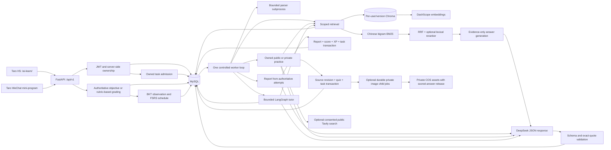
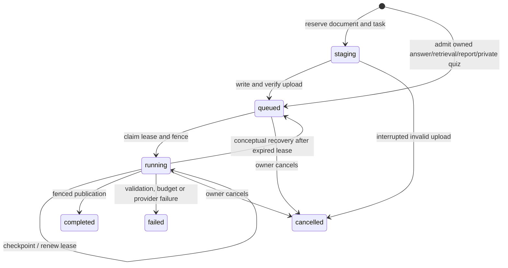

# Architecture: Verified Implementation

This describes the locally verified implementation, not a claim that deployment or native-device
acceptance is complete. Current results and release blockers are maintained in
[the implementation ledger](implementation-tracker.md).

## Application Boundary

The production gateway prefix is planned as `/ai-learn/api/v1`; it must strip `/ai-learn` before forwarding to the backend's actual `/api/v1` routes. The target public routes have not been deployed. Existing application gateways and data remain untouched.

## Identity and Data

H5 uses independent account credentials hashed with salted scrypt. WeChat retains server-side code exchange. Tokens contain the server-issued user identity; model tools and request bodies cannot select another user. Account merging is not implemented.

MySQL is authoritative for documents, active revisions, source chunks, question answers, attempts and task state. Chroma results cannot authorize access. Every dense/BM25/reranker path starts with an owned SQL corpus; Chroma also receives a pre-filtered scope. Source bodies are taken from canonical SQL rows, not arbitrary vector metadata. Document tombstones revoke retrieval immediately; physical cleanup is retried separately.

Practice serialization removes answers, explanations, concept labels, citations and answer-bearing
images before a submitted attempt. Server grading locks the quiz, deduplicates the attempt and
returns the stored result on identical replay. Modified replay returns a conflict. Report scoring
uses stored attempts; report/score/XP/task publication shares one fenced transaction. Private
practice locks source revisions before publishing; cancelled jobs and stale sources cannot publish.
Public practice uses the same durable admission with an empty private-document scope. Optional
images are separately fenced child jobs; image failure does not erase completed text questions.

## Task Lifecycle

Private text questions now require 1-3 distinct exact quotations. The server resolves evidence IDs
against the structured retrieval context and attaches document/revision/chunk/page/section itself.
At least two supplied fragments must be covered when available; this is fragment coverage, not
complete knowledge-point coverage or semantic entailment. Invalid output enters the existing
three-attempt repair budget. Quotes are withheld with answers before submission. Answer/history
responses recheck current owner-scoped sources and replace unavailable quotations with a notice.
Known older quizzes remain readable but do not acquire fabricated citations. Drain active generation
jobs before deploying a changed output contract; completed stored quizzes are not regenerated.

Recovery is implemented by reclaiming an expired running row directly, not by a separate message delivery step. A persisted `call_pending` marker stops recovery from repeating an external request whose result is unknown. When a known response has already been checkpointed, answer/report validation can continue without another provider request. SQL idempotency keys bind owner, task kind and canonical payload. An active payload fingerprint also coalesces concurrent submissions with different keys. Completed immutable reports also reuse their completed task across different keys; failed/cancelled jobs permit an explicit new request. The synchronous report endpoint waits for the same job as the asynchronous endpoint.

Private text quiz generation also validates a known response without initializing a provider client.
Its generic job result contains only `quiz_id` and `title`, never the answer-bearing checkpoint.
The compatibility quiz poll restores the owned saved quiz and applies answer disclosure rules.
Migration 7 retains up to 64 additional coalesced request keys per task, in the admission transaction.
Without this binding, a second device whose response was lost could retry after completion and buy
another task. Original request keys need no backfill; an explicitly new key can still request a new
practice after completion. User/kind/key ownership and payload mismatch checks apply to aliases too.
Migration 8 moves the alias lifecycle foreign key to its owner: linking it to a running job took
a shared job lock while admission held the user row, conflicting with report publication's job-to-XP
lock order. A real held-job test verifies admission does not wait on the publisher. Alias reads join
both owner and kind, and account deletion cascades to aliases. Future job-pruning maintenance must
delete its aliases explicitly; no independent job-pruning operation is currently implemented.

The queue is a MySQL table, not an in-memory job dictionary. The Python worker loop only controls execution. It is currently embedded in the single API process so embedded Chroma is not opened by independent writer processes. Deployment must use one process with `WORKER_ENABLED=true` for this configuration. No multi-service or multi-Agent topology is claimed.

Limits are recorded in code/config: three per-stage attempts including the first, 12 external requests per task, 60,000 UTF-8 input bytes per task, a pre-next-call guard at 20,000 known tokens, and 180 seconds from first claim. Indexing further limits 100 chunks, batches of 10, and parser/provider timeouts. Site-wide daily UTC request/input limits are transactionally reserved before new queue calls. They are conservative admission limits, not a billed-currency prediction; missing provider usage is explicit.

The frontends use awaited polling with cancellation of transport and timers. Refresh restores a per-account task reference. Hiding a page does not imply server cancellation. Real stages and trace IDs are exposed to the owner; prompts, raw checkpoints and lease tokens are not. Timeline `duration_ms` values currently measure elapsed intervals between checkpoint observations, not disjoint CPU-time spans, and must not be added as independent tool costs.

## RAG and Learning Scope

Parser layout metadata records page/section, content hash and stable chunk identity. Embedding model, dimensions, endpoint and chunk settings contribute to the index fingerprint. Changing that fingerprint requires explicit rebuilding. The evaluation compares dense, RRF hybrid and lexical reranking with the same scoped corpus; [actual results](rag-evaluation.md) do not show a reranker improvement on the current synthetic set.

Grounded answers use a constrained JSON service, not arbitrary ReAct execution. Public search is
one explicit, bounded Tavily request; private text cannot enter it. The existing legacy ReAct code
is not the new practice path. [Tutoring](tutoring.md) uses a fixed LangGraph state graph with typed,
owner-bound tools, six-turn sessions and explicit confirmation before practice generation.

Five question types have server-authoritative assessment. Written answers use bounded structured
rubric checks, not an asserted human correctness oracle. Grade publication, BKT observations and
FSRS schedules are transactional. Named error notebooks require explicit collection; they do not
replace the underlying wrong-answer history. See [assessment](practice-and-assessment.md),
[learning algorithms](learning-algorithms.md), [review maps](study-maps.md) and the
[executed synthetic fitting experiment](algorithm-experiments.md). Review relationship maps are
not inferred prerequisite graphs. [Learning paths](learning-paths.md) store explicitly user-set
prerequisite edges and immutable confirmed plans; their deterministic recommendation policy is
separate from BKT mastery estimation and FSRS scheduling.

## Companion Conversations

Both selectable characters have separate versioned canonical biographies, primary/secondary
personality traits and four ordered chapters. Dialogue is a bounded single-model task, not a
second autonomous agent. Each `(user_id, character_id)` owns its conversation, confirmed memories
and story progress. The model receives only unlocked canon, at most six recent turns and twelve
confirmed preferences; it has no document, SQL, shell or account-management tools.

Memory suggestions quote the current message and require a user confirmation. Individual memory
edits do not erase transcripts; the explicit full-memory reset clears transcript and persisted job
content too, while retaining cost counters. Cancellation and reset fence publication. The latest
100 conversation turns remain available. The companion is explicitly fictional, and its chat is
not the cited knowledge assistant. Canonical prompts and schema checks reduce inconsistency;
they are not a formal guarantee of semantic consistency for every possible conversation.

## HTTP Boundaries

Production startup rejects debug mode, automatic schema initialization and short JWT secrets.
Explicit CORS origins replace wildcard credentials. JSON mutation bodies are bounded to 512 KiB;
uploads retain their separate limits. Error diagnostics retain request IDs and stack locations,
not raw exception strings or provider URLs. `/api/v1/health` is liveness;
`/api/v1/ready` checks the database and embedded worker.

Optional packaged H5 serving only falls back for page namespaces; API and missing-asset errors
remain errors. H5 CSP permits same-origin scripts and Blob reads used by local file upload and
Mermaid, not arbitrary remote scripts. Path separation does not isolate the origin from another
same-domain application's XSS; no domain-wide service worker is installed.

## Current Limitations

Image downloads use `outbound_service`: public HTTPS/443 only, actual connector DNS-result checks,
manual per-hop redirect validation (at most three requests), no environment proxy/cookie jar,
verified TLS, exact MIME and streamed byte limits, and a total deadline including semaphore wait.
The implementation follows the connector-level defense described in the
[aiohttp SSRF guidance](https://docs.aiohttp.org/en/stable/client_middleware_cookbook.html).
The image service requires its separate image key; an empty image base still derives the native
endpoint from the configured compatible base. This preserves the configured
[Qwen image API](https://help.aliyun.com/zh/model-studio/qwen-image-api) rather than treating an empty optional URL as a broken key.
Image reservations and per-user UTC quotas are transactional. Downloads have decoded-pixel and
byte caps, re-encode metadata-free JPEG, and write only tracked private COS keys. Unsigned access
must return 403 before and after upload. Signed reads expire after 120 seconds and require a stored
answer and current owned source. A signed URL remains a temporary bearer capability; revocation
is not instantaneous after issuance. Cleanup uses a tracked list and bounded retries, never a
bucket-wide delete. See [private illustrations](quiz-illustrations.md).

- Native WeChat automation and device verification are pending the local tool authorization/service-port gate.
- Cloud schema selection and backup/migration rehearsal remain pending; test databases are independent loopback schemas.
- Retired-index maintenance and deployed security-header verification still need release validation.
- Private questions have exact quotation and available-fragment coverage validation, not a measured guarantee of full knowledge-point coverage or semantic entailment.
- Windows parser subprocess timeouts are tested, but Linux-only memory limits have no equivalent verified Windows hard cap.
- The small synthetic retrieval dataset proves reproducibility, not real-user learning outcomes or general answer correctness.
