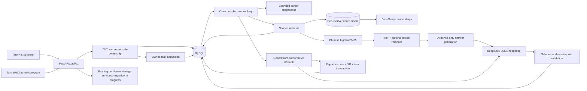
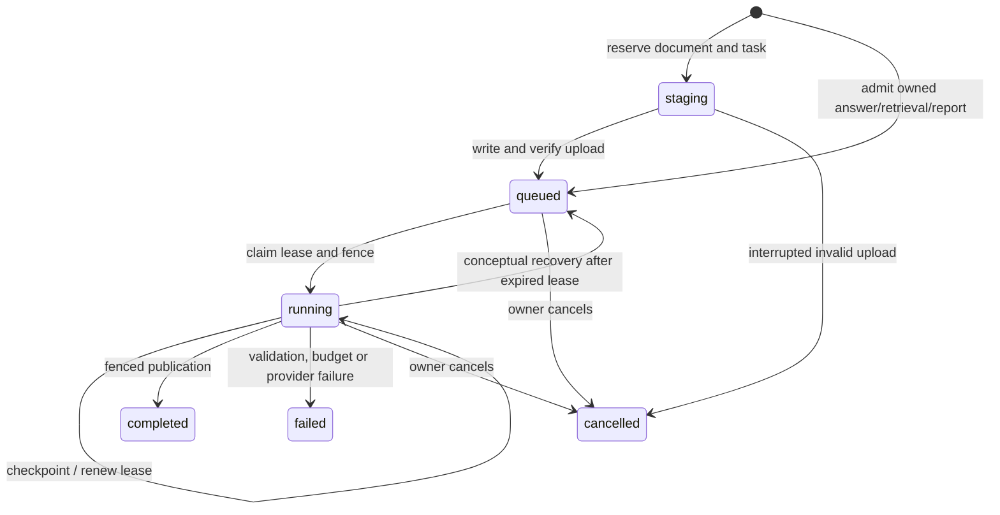

# Architecture: Verified Implementation

This describes the M3 queue checkpoint, not a claim that all planned learning features are finished. Current acceptance and release blockers are maintained in [the implementation ledger](implementation-tracker.md).

## Application Boundary

The production gateway prefix is planned as `/ai-learn/api/v1`; it must strip `/ai-learn` before forwarding to the backend's actual `/api/v1` routes. The target public routes have not been deployed. Existing application gateways and data remain untouched.

## Identity and Data

H5 uses independent account credentials hashed with salted scrypt. WeChat retains server-side code exchange. Tokens contain the server-issued user identity; model tools and request bodies cannot select another user. Account merging is not implemented.

MySQL is authoritative for documents, active revisions, source chunks, question answers, attempts and task state. Chroma results cannot authorize access. Every dense/BM25/reranker path starts with an owned SQL corpus; Chroma also receives a pre-filtered scope. Source bodies are taken from canonical SQL rows, not arbitrary vector metadata. Document tombstones revoke retrieval immediately; physical cleanup is retried separately.

Practice serialization removes answers and explanations before a submitted attempt. Server grading locks the quiz, deduplicates the attempt and returns the stored result on identical replay. Modified replay returns a conflict. Report scoring uses stored attempts; report/score/XP/task publication shares one fenced transaction. A failed final task update rolls back the report and XP. Concurrent quiz generation is still being migrated and is not covered by this guarantee yet.

## Task Lifecycle

Recovery is implemented by reclaiming an expired running row directly, not by a separate message delivery step. A persisted `call_pending` marker stops recovery from repeating an external request whose result is unknown. When a known response has already been checkpointed, answer/report validation can continue without another provider request. SQL idempotency keys bind owner, task kind and canonical payload. An active payload fingerprint also coalesces concurrent submissions with different keys. Completed immutable reports also reuse their completed task across different keys; failed/cancelled jobs permit an explicit new request. The synchronous report endpoint waits for the same job as the asynchronous endpoint.

The queue is a MySQL table, not an in-memory job dictionary. The Python worker loop only controls execution. It is currently embedded in the single API process so embedded Chroma is not opened by independent writer processes. Deployment must use one process with `WORKER_ENABLED=true` for this configuration. No multi-service or multi-Agent topology is claimed.

Limits are recorded in code/config: three per-stage attempts including the first, 12 external requests per task, 60,000 UTF-8 input bytes per task, a pre-next-call guard at 20,000 known tokens, and 180 seconds from first claim. Indexing further limits 100 chunks, batches of 10, and parser/provider timeouts. Site-wide daily UTC request/input limits are transactionally reserved before new queue calls. They are conservative admission limits, not a billed-currency prediction; missing provider usage is explicit.

The frontends use awaited polling with cancellation of transport and timers. Refresh restores a per-account task reference. Hiding a page does not imply server cancellation. Real stages and trace IDs are exposed to the owner; prompts, raw checkpoints and lease tokens are not. Timeline `duration_ms` values currently measure elapsed intervals between checkpoint observations, not disjoint CPU-time spans, and must not be added as independent tool costs.

## RAG and Learning Scope

Parser layout metadata records page/section, content hash and stable chunk identity. Embedding model, dimensions, endpoint and chunk settings contribute to the index fingerprint. Changing that fingerprint requires explicit rebuilding. The evaluation compares dense, RRF hybrid and lexical reranking with the same scoped corpus; [actual results](rag-evaluation.md) do not show a reranker improvement on the current synthetic set.

Grounded answers use a constrained JSON service, not ReAct tool execution. Existing public-topic search still uses the repository's ReAct implementation and is separate from private-document retrieval. Its safety/budget review, a learning workflow graph, Socratic tutoring, mastery tracking and FSRS integration remain explicit next stages. Installing LangGraph or an algorithm dependency alone will not count as implementing those capabilities.

## Current Limitations

Image downloads use `outbound_service`: public HTTPS/443 only, actual connector DNS-result checks,
manual per-hop redirect validation (at most three requests), no environment proxy/cookie jar,
verified TLS, exact MIME and streamed byte limits, and a total deadline including semaphore wait.
The implementation follows the connector-level defense described in the
[aiohttp SSRF guidance](https://docs.aiohttp.org/en/stable/client_middleware_cookbook.html).
The image service requires its separate image key; an empty image base still derives the native
endpoint from the configured compatible base. This preserves the configured
[Qwen image API](https://help.aliyun.com/zh/model-studio/qwen-image-api) rather than treating an empty optional URL as a broken key.
Quota storage failures skip paid image generation with a notice. These changes do not yet provide
atomic image-attempt quotas, durable image calls, decoded image limits, private COS URLs or safe
legacy Tavily URL extraction; those remain release gates.

- Native WeChat automation and device verification are pending the local tool authorization/service-port gate.
- Cloud schema selection and backup/migration rehearsal remain pending; test databases are independent loopback schemas.
- Legacy public search, quiz/image generation, retired-index maintenance and production security headers still need release hardening.
- Windows parser subprocess timeouts are tested, but Linux-only memory limits have no equivalent verified Windows hard cap.
- The small synthetic retrieval dataset proves reproducibility, not real-user learning outcomes or general answer correctness.
