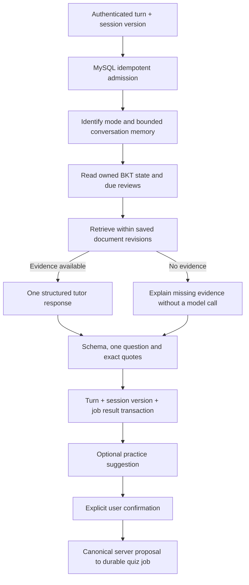

# Bounded Learning Tutor

The learning assistant has two distinct experiences: evidence-backed question answering and
multi-turn tutoring. The latter asks one guiding question per turn. Wrong-answer tutoring compares
an owned persisted attempt with its saved reference; a proposed error category is not a diagnosis
of the learner and is only applied to the card after explicit confirmation.

## Workflow and Authority



`tutor_graph.py` uses LangGraph `StateGraph` with five visited nodes and a recursion limit of eight.
This is a fixed single-workflow graph, not multiple autonomous agents. MySQL task checkpoints own
recovery; LangGraph process memory is not the durable store. Legacy ReAct dependencies are not
claimed as this workflow's execution engine.

`tutor_tools.py` defines strict schemas for retrieval, learning-state reads, review-queue reads and
practice proposals. User identity and document scope are bound server-side. Arguments cannot
contain a user ID, SQL, path, shell command or arbitrary tool name. Four fresh tool calls are the
per-run ceiling. Proposing practice is read-only. Confirming it loads the saved proposal, checks
the owned session version and derives a stable request key; the browser sends only `version` and
`confirmed: true`. Repeated confirmation returns the same task, not another paid quiz.

Session creation, turn admission and deletion are owner-scoped. A session permits six completed
turns, one active turn and at most three selected documents. There are at most fifty sessions per
account. The model receives at most the previous two turns, with explicit field-length bounds.
Changed source revisions invalidate access rather than retaining stale usable citations.

Diagnosis evidence marked `stored_practice` is the saved question, bounded option text, reference and latest incorrect
attempt, not independent factual verification. Private-document evidence retains its source
identity. All quotes must be exact substrings; that does not establish semantic entailment.
Material, prompts inside documents and student replies remain untrusted data. No private chain
of thought is requested, exposed or stored in a developer panel.

## Failure, Recovery and Cost

- Each structured model stage allows three total attempts, including the first. The SDK has no
  additional retry loop. One tutor turn permits at most one embedding plus three text requests.
- Shared durable job limits also apply: total time, daily calls, input bytes and known tokens.
  An uncertain in-flight provider outcome is not automatically bought again after a restart.
- A submitted request key and body survive a lost POST response. Refresh retrieves the pending
  owned job. Cancellation prevents turn publication; a new attempt after a terminal failure needs
  explicit action. Concurrent changed requests receive a version conflict.
- The turn, session version and completed job reference commit together. Generic task responses
  expose a reference, not private conversation checkpoints. Owners see stages, trace IDs, usage
  and compact tool summaries, not raw prompts or lease tokens.
- Error-category confirmation does not rewrite grades, BKT observations or FSRS due dates.
  Practice confirmation does not auto-enable web search or illustrations.

## Executed Verification

From the repository root after starting the isolated services described by `scripts/run_local.py`:

```powershell
backend/venv/Scripts/python.exe scripts/test_offline.py -q -k tutor
backend/venv/Scripts/python.exe scripts/test_database.py -k tutor
cd frontend
npx playwright test e2e/tutor.spec.ts
```

The default browser scenario uses explicitly synthetic held checkpoints, actual HTTP routes,
MySQL and the worker, with zero provider calls. It covers cancellation, a lost POST response,
refresh recovery, two persisted turns, quote navigation, declined practice and viewport bounds.
Database tests additionally cover owner isolation, six-turn limits, stale sources, competing
devices, cancelled publication, rollback and canonical practice confirmation.

Opt-in paid integration is separate:

```powershell
backend/venv/Scripts/python.exe scripts/smoke_tutor.py --paid
cd frontend
$env:AI_LEARN_TUTOR_REUSE='1'
npx playwright test e2e/tutor.spec.ts -g 'saved real tutor responses'
$env:AI_LEARN_TUTOR_PRACTICE_LIVE='1'
npx playwright test e2e/tutor.spec.ts -g 'explicitly confirmed'
```

The first command requires the local public learning-rate fixture prepared by the M2 smoke test.
It validates its full source content before any export. Its ceiling is eleven external calls;
the saved-response scenario makes none. The last command is explicitly paid, bounded to eight
calls, including an optional separate tutor request for practice suggestions. Never enable these
flags in ordinary CI. These Windows commands were executed; other shells must use their own
environment-variable syntax and Python executable path.

Recorded on 2026-09-15:

| Run | External calls | Reported tokens | What it proves |
| --- | ---: | ---: | --- |
| Two Socratic turns + synthetic wrong-answer diagnosis | 5 | 2959 | Real providers, exact quotes, bounded memory, tentative diagnosis |
| Explicit practice suggestion + confirmed two-question quiz | 4 | 2572 | Real UI confirmation, canonical proposal, deduplication and answer hiding |

The second run took 12791 ms end to end. Embedding usage is not included when the provider wrapper
does not report it. Currency cost is unknown, not zero. These are wiring and schema tests, not
human-labelled correctness or student learning-effect measurements. The first paid-practice
preflight found no optional suggestion and stopped before any new provider request; the test then
used an explicit student request in a separate session instead of fabricating a proposal.

Evidence: [provider traces](evidence/tutor-live.json), [confirmed practice](evidence/tutor-practice-live.json),
[browser checks](evidence/tutor-ui.json), and real H5 screenshots
[tutoring](screenshots/h5/45-live-socratic-tutor.png),
[wrong-answer review](screenshots/h5/46-live-wrong-answer-tutor.png),
[generated practice](screenshots/h5/47-live-tutor-practice.png).

Screenshot inspection reproduced a floating companion over student text. The tutor now uses the
same expandable, reserved-space partner as answering pages. A separate layout feedback loop was
reproduced as 31.56 px of button motion; heading reservation no longer depends on collision results.
Browser regressions retain actual geometry checks, with no forced clicks to conceal instability.

Native IDE/runtime, real devices and production deployment remain separate unverified gates.
Semantic hint quality and conflict handling are model-dependent; one question and exact quotation
validation cannot guarantee that a hint never gives away too much or that a diagnosis is correct.
